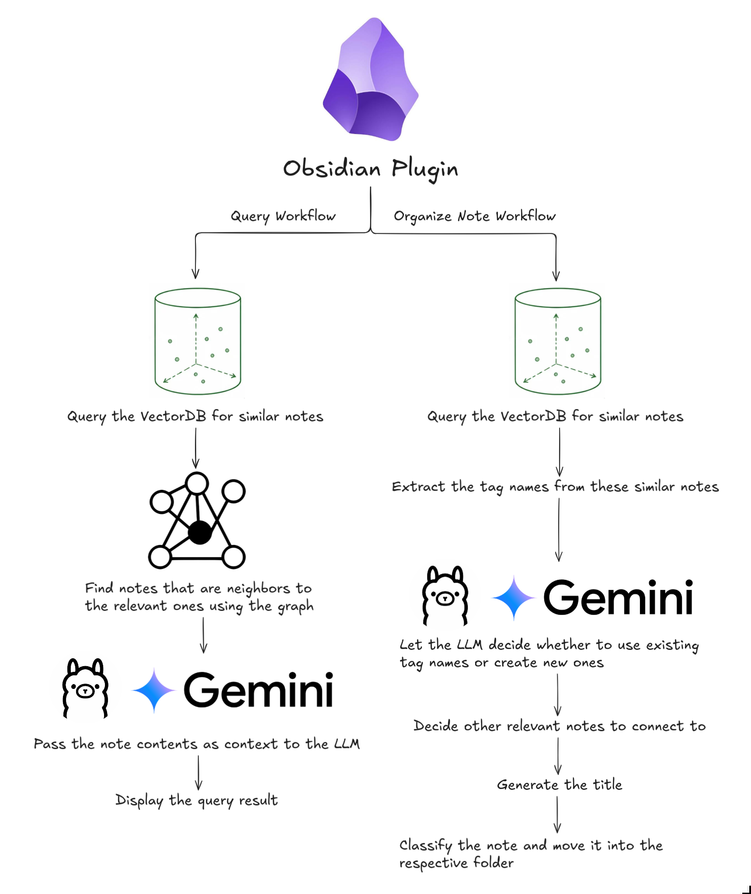

# Lynx Note Organizer

This plugin automatically links and structures your notes into a second brain. Runs fully locally on your machine.

## What it solves

I've always wanted to be able to jot down a thought, idea from a book/website, or a fix to an issue I might encounter later, but I've always found myself getting stuck on how to organize these notes.

I then end up going down a rabbit hole of trying to find different note-taking methods to organize these thoughts and spend more time doing that than actually creating the notes.

This plugin removes the friction of having to manually organize your notes. It uses the [Zettelkasten method](https://zettelkasten.de/introduction/) to automatically tag and link your notes to other relevant notes. This allows you to focus on just the note content and not the organization.


## Installation

Make sure you have [Obsidian](https://obsidian.md/) installed. Then, download the latest release of the [plugin](https://community.obsidian.md/plugins/impact-forge) from Obsidian's community plugins page.

## Usage

### LLM

#### Using the Gemini API

If you have a Gemini API key then you can put it into the plugin settings and it will use it to organize and query your notes.

#### Using Ollama

If you want to run everything locally, then simply run ollama locally on http://localhost:11434 and the plugin will automatically detect it and start using the LLM. Prior to running ollama though, you'll need to download the models, so run the following commands:
```
ollama pull qwen3:1.7b
ollama pull qwen3:4b
ollama pull nomic-embed-text # For the vector embeddings
```

### Organizing notes

1. Click the "Create New Note" button in the sidebar to create a note with a template applied.
2. Write down your content in the note. Try to keep notes atomic meaning that they should be focused on a single idea or topic.
3. When you're done, click the "Organize Note" button in the sidebar. It will automatically tag and link your note to other relevant notes.

You can also move notes around, update tag names, references, etc, and the Graph and Vector database will automatically update.

### Querying notes

1. Simply enter your question in the textarea in the sidebar.
2. Click the "Submit" button to see the results.

## How it works

Here is a diagram showing the architecture and flow of the plugin:


The code for both the workflows can be found in the [workflows folder](https://github.com/Github11200/Impact-Forge/tree/master/src/workflows).

## Tech Stack

- [Obsidian](https://obsidian.md/)
- [Ollama](https://ollama.com/)
- [Langchain](https://docs.langchain.com/build-overview)
- [Graphology](https://graphology.github.io/)
- [Typescript](https://www.typescriptlang.org/)
- [Svelte](https://svelte.dev/)